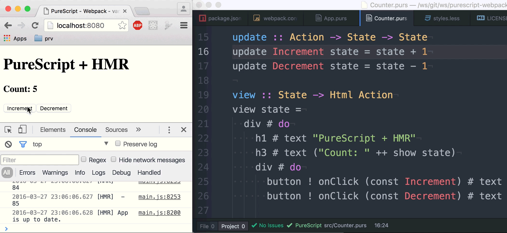

# purescript-webpack-vanilla-hmr

Simple + fast build of **[PureScript](purescript.org)** with **[webpack](https://webpack.github.io)** and **[Vanilla Hot Module Replacement (HMR)](https://webpack.github.io/docs/hot-module-replacement.html)**. No [Pulp](https://github.com/bodil/pulp), no [Gulp](http://gulpjs.com/) or anything else - just [webpack](https://webpack.github.io/).



## Why?

"I strongly suggest you to consider using vanilla HMR API instead of React Hot Loader, React Transform, or other similar projects. It’s just so much simpler—at least, it is today." _Quote by Dan Abranov (Creator of [Redux](redux.js.org), [React Hot Loader](https://github.com/gaearon/react-hot-loader) etc.)_

Why not the using the same stuff for building PureScript application today?

## Installation

```
npm i
npm start
```
Open http://localhost:8080/

## Acknowledge

- Documentation of webpack: ["Hot Module Replacement" (HMR)](https://webpack.github.io/docs/hot-module-replacement.html)
- ["Hot Reloading in React or, an Ode to Accidental Complexity"](https://medium.com/@dan_abramov/hot-reloading-in-react-1140438583bf#.vnlkto5p1) by Dan Abramov
- Redux PR 1455 ["RFC: remove React Transform from examples"](https://github.com/reactjs/redux/pull/1455)
- [purs-loader](https://github.com/ethul/purs-loader),  [purescript-webpack-plugin](https://www.npmjs.com/package/purescript-webpack-plugin) and [purescript-webpack-example](https://github.com/ethul/purescript-webpack-example/blob/master/webpack.config.js) by [ethul](https://github.com/ethul)
- [A boilerplate for running a Webpack workflow in Node express](https://github.com/christianalfoni/webpack-express-boilerplate) by [Christian Alfoni](https://github.com/christianalfoni)
- Counter Example of [Pux](https://github.com/alexmingoia/purescript-pux), an awesome PureScript FRP interface to React by [Alex Mingoia](https://github.com/alexmingoia)

### License
[MIT](./LICENSE)

Have fun :) -- Jens Krause -- [jkrause.io](http://jkrause.io)
